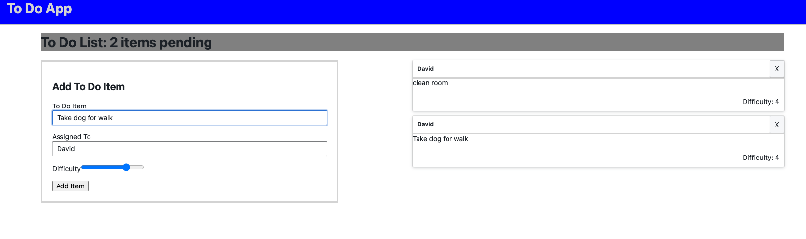
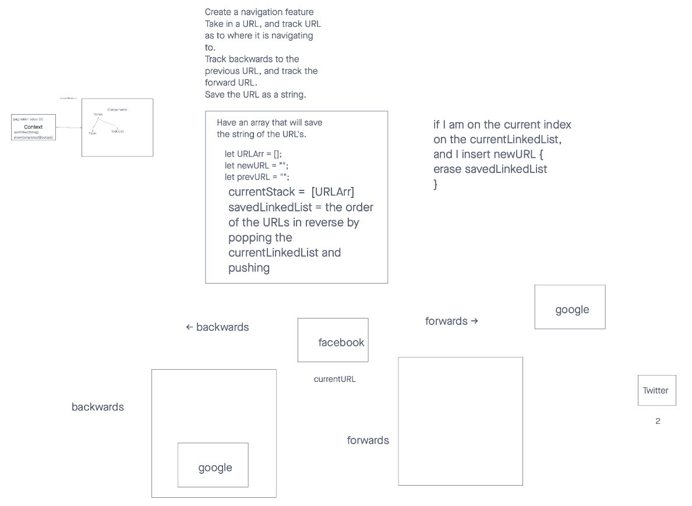

# Context Api

A Web Application for securely managing a To Do List

## Setup

    npm i

## Running the app

    npm stort

## Development Process, Milestones

At every stage of development, the application should be publicly deployed

Phase 1: Application Setup

- Basic To Do List Management, using Hooks

Phase 2: Persistence

- Implement a custom Form Hook
- Implement a custom Ajax Hook
- Connect to a live API for storing To Do Items

Phase 3: Settings and Global Context

- Implement user settings for displaying items

Phase 4: Authorization

- Require a login to access the list
- Restrict access to adding, editing, deleting to certain user types

